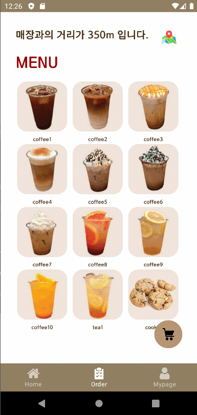

# mobile_6_AOS_NetWork_PJT

## 회원가입 및 아이디 중복확인(F02, F03)

## 코멘트 및 장바구니(F09, F10, F11, F12, F13)

## 상품 주문 및 NFC, 비콘(F06, F19, F21)

- NFC 태그를 찍지 않고 '취소'를 누른 경우 -> 주문이 안됨.
- NFC 태그를 찍은 후 '취소'를 누른 경우 -> 주문 완료.
- 비콘과의 거리가 1미터 이내인 경우 '이용 알림' 다이얼로그를 보여줌. 
- 다이얼로그 하단에는 최근 주문 내역이 있을 경우 최근 주문 내역을 표시, 없으면 표시하지 않음.

## NFC Tagging 시 애플리케이션 실행(F20)

## 회원 등급 관리 및 재 주문(F14, F22)

